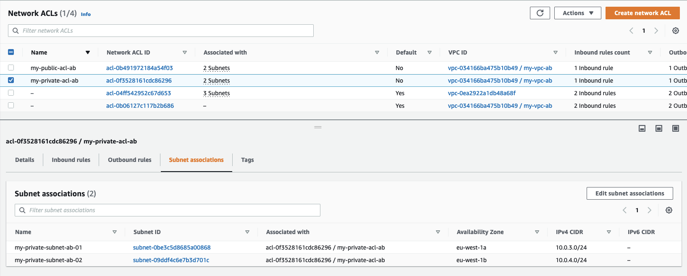

# TP AWS : Architecture & WEB Server integration

Authors : Badr TADJER | Adrien PLOT

## Introduction

TP Architecture & WEB Server integration

## Part 1 : Lab Connection

Region : Ireland
Group : Lab_Student_3

## Part 2 : Lab Connection

### Architecture

### 2.1 : Create a VPC

name : my_vpc_ab

### 2.2 : Create a Gateway

name : my_igw_ab

### 2.3 : Create a Subnet

names :

- my_private_subnet_ab-01
- my_private_subnet_ab-02
- my_public_subnet_ab-01
- my_public_subnet_ab-02

### 2.4 : Create a Route Table

names :

- my_route_table_private_subnet_ab-01
- my_route_table_private_subnet_ab-02
- my_route_table_public_subnet_ab-01
- my_route_table_public_subnet_ab-02

### 2.5 : Create ACL

- my_private_acl_ab

- my_public_acl_ab

### 2.6 : Create a Security Group

names :

- my_private_security_group_ab
- my_public_security_group_ab

### 2.7 : Create a AMI

name : serveur-web-instance-ab

ssh connection to the AMI :

Pages result (test.html & ping.html) :

### 2.8 : Create a NAT Group

### 2.9 : Create a NAT Instance

A bastion is a server that is accessible from the internet and that is used to access a private network. It is a security best practice to use a bastion to access a private network.

Ping resutl :

## Part 3 : Load Balancer & Auto Scaling

### AWS Architecture

### 3.1 : Create a AMI

Create a AMI from the web server instance created in part 2.7

### 3.2 : Create a configuration template

name : autoscaling_launch_configuration_ab

### 3.3 : Create a Auto Scaling Group

name : autoscaling_group_ab

Configuration with 2 instances MIN/MAX

Instance creation verification :

Try to delete one instance :

a new instance has been created

### 3.4 : Create a Load Balancer

name : load_balancer_ab

target group creation :

### 3.5 : Add Target Group to Load Balancer

Health check :

### 3.6 : Test Load Balancer

After customizing the test.html page, we can test the load balancer :

